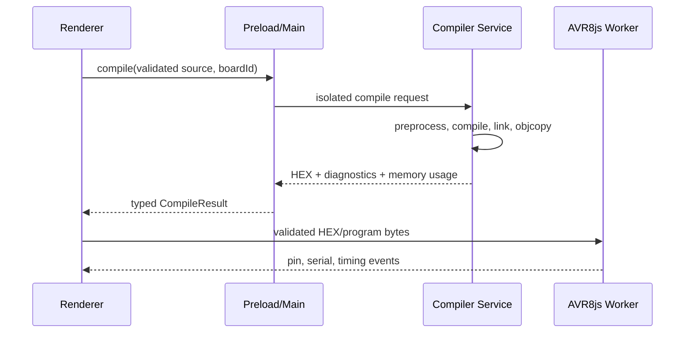

# Offline Arduino Simulator — Setup Specification

Status: architecture baseline for MVP implementation  
Handoff role: authoritative first-step specification for Claude Code  
Initial board target: Arduino Uno / ATmega328P / 16 MHz  
Primary shell recommendation: Electron + React + TypeScript  
Operating principle: no runtime network dependency, no paid API, no downloaded compiler at first launch

## 1. Executive architecture decision

Use Electron for version 1. The installer will be larger than a Tauri build, but the AVR toolchain and Arduino core already contribute meaningful size. Electron provides the most direct and predictable bridge to Node's `child_process.spawn`, Monaco, AVR8js, Web Workers, and cross-platform packaging.

The application has four trust and workload zones:

1. **Renderer** — React, Monaco Editor, canvas, component controls, console, and compile/run buttons. It has no Node.js access.
2. **Preload bridge** — exposes a very small typed API: compile, cancel compile, receive compiler events, save/open project.
3. **Electron main process** — validates requests, creates isolated build directories, invokes only allowlisted bundled AVR programs, reads the `.hex`, and cleans temporary files.
4. **Simulation worker** — runs AVR8js and component state models off the UI thread. It receives validated Intel HEX/program bytes and emits pin/peripheral events.

Do not run `avr-gcc` in the renderer, expose raw IPC, accept arbitrary compiler arguments, or use `shell: true`.

## 2. Recommended project directory

```text
offline-arduino-simulator/
├─ package.json
├─ package-lock.json
├─ electron-builder.config.cjs             # selects one audited native payload per build
├─ tsconfig.json
├─ vite.config.ts
├─ vitest.config.ts
├─ eslint.config.js
├─ README.md
├─ LICENSE
├─ THIRD_PARTY_NOTICES.md
│
├─ apps/
│  └─ desktop/
│     ├─ src/
│     │  ├─ main/                         # privileged Electron process
│     │  │  ├─ index.ts                   # app lifecycle and BrowserWindow
│     │  │  ├─ ipc/
│     │  │  │  ├─ register-ipc.ts
│     │  │  │  ├─ validate-sender.ts
│     │  │  │  └─ channels.ts
│     │  │  ├─ compiler/
│     │  │  │  ├─ compiler-service.ts     # compilation orchestration
│     │  │  │  ├─ process-runner.ts       # safe spawn, timeout, output cap
│     │  │  │  ├─ toolchain-paths.ts      # dev/packaged resource resolution
│     │  │  │  ├─ ino-preprocessor.ts     # Arduino-compatible preprocessing
│     │  │  │  ├─ build-recipe.ts         # argv arrays for each AVR tool
│     │  │  │  ├─ diagnostics-parser.ts   # GCC stderr -> Monaco markers
│     │  │  │  ├─ intel-hex.ts            # validate/parse HEX
│     │  │  │  ├─ board-profiles.ts
│     │  │  │  └─ core-cache.ts
│     │  │  ├─ projects/
│     │  │  │  ├─ project-service.ts
│     │  │  │  └─ project-schema.ts
│     │  │  └─ security/
│     │  │     ├─ resource-integrity.ts
│     │  │     └─ path-policy.ts
│     │  │
│     │  ├─ preload/
│     │  │  ├─ preload.ts                  # contextBridge implementation
│     │  │  └─ electron-api.d.ts           # window.electronAPI declaration
│     │  │
│     │  └─ renderer/
│     │     ├─ index.html
│     │     ├─ main.tsx
│     │     ├─ app/
│     │     ├─ editor/                     # Monaco models and diagnostics
│     │     ├─ canvas/                     # native SVG circuit surface
│     │     ├─ components/                 # LED, resistor, button, etc.
│     │     ├─ simulator/
│     │     │  ├─ simulator.worker.ts      # AVR8js execution loop
│     │     │  ├─ avr-runner.ts
│     │     │  ├─ board-pin-map.ts
│     │     │  └─ peripheral-models/
│     │     ├─ state/
│     │     └─ styles/
│     └─ tests/
│        ├─ ipc-security.test.ts
│        ├─ compiler-integration.test.ts
│        └─ renderer/
│
├─ packages/
│  ├─ contracts/                           # shared IPC DTOs and schemas
│  │  └─ src/compiler.ts
│  ├─ circuit-model/                       # pure simulation/circuit types
│  └─ ui/                                  # reusable visual components
│
├─ vendor/                                 # build inputs, not loaded from network at runtime
│  ├─ toolchains/
│  │  ├─ win32-x64/
│  │  │  ├─ bin/avr-gcc.exe
│  │  │  ├─ bin/avr-g++.exe
│  │  │  ├─ bin/avr-ar.exe
│  │  │  ├─ bin/avr-objcopy.exe
│  │  │  ├─ bin/avr-size.exe
│  │  │  ├─ bin/*.dll
│  │  │  ├─ avr/include/
│  │  │  ├─ avr/lib/
│  │  │  ├─ lib/gcc/avr/<version>/
│  │  │  └─ manifest.json
│  │  ├─ darwin-x64/
│  │  ├─ darwin-arm64/
│  │  └─ linux-x64/
│  ├─ arduino-avr/
│  │  ├─ cores/arduino/
│  │  ├─ variants/standard/
│  │  ├─ libraries/                        # only explicitly supported libraries
│  │  ├─ boards.txt
│  │  ├─ platform.txt
│  │  └─ manifest.json
│  └─ licenses/
│     ├─ avr-gcc/
│     ├─ avr-libc/
│     ├─ arduino-core-avr/
│     └─ avr8js/
│
├─ resources/
│  ├─ examples/
│  ├─ board-art/
│  └─ component-icons/                     # authored SVG/CSS only
│
├─ scripts/
│  ├─ fetch-toolchain.mjs                  # build-time only; checksum locked
│  ├─ verify-toolchains.mjs
│  ├─ smoke-compile.mjs
│  └─ generate-third-party-notices.mjs
│
├─ toolchain-lock.json                     # URL, version, SHA-256, license, target
└─ .github/workflows/
   ├─ test.yml
   └─ release-desktop.yml
```

### Boundary rules

- `renderer` may import `packages/contracts`, `packages/circuit-model`, and UI code. It must never import Electron, `node:*`, filesystem, or process-spawning modules.
- `main` owns all filesystem and compiler access.
- `simulator.worker.ts` owns the AVR execution loop. A runaway sketch must be terminable by terminating and recreating the worker.
- `vendor` is immutable runtime material. Projects, caches, and build outputs are written outside the installed application.

## 3. Board scope and compiler prerequisites

`avr-gcc` alone is not enough to compile an Arduino sketch. The offline bundle must contain:

- `avr-gcc`, `avr-g++`, `avr-ar`, `avr-objcopy`, and `avr-size`;
- AVR target headers, device specs, linker scripts, `libgcc`, and `avr-libc`;
- Arduino AVR core source;
- the Uno `standard` variant and `pins_arduino.h`;
- supported Arduino libraries and their sources;
- an Arduino-compatible `.ino` preprocessing stage.

Start with exactly one board profile:

```ts
export const BOARD_PROFILES = {
  uno: {
    id: 'uno',
    fqbn: 'arduino:avr:uno',
    mcu: 'atmega328p',
    fCpu: '16000000L',
    boardMacro: 'ARDUINO_AVR_UNO',
    architectureMacro: 'ARDUINO_ARCH_AVR',
    core: 'arduino',
    variant: 'standard',
    flashMaxBytes: 32_256,
    sramMaxBytes: 2_048,
    eepromBytes: 1_024,
  },
} as const;
```

Do not advertise Mega, Nano, Leonardo, ESP32, or arbitrary third-party libraries until both compilation and the simulation models support them.

## 4. Cross-platform `avr-gcc` bundling strategy

### 4.1 Produce one installer per OS and CPU architecture

Do not package every toolchain in every installer. Release separate artifacts:

| App target | Runtime key | Compiler payload |
| --- | --- | --- |
| Windows 10/11 x64 | `win32-x64` | native Windows x64 AVR toolchain, including required DLLs |
| macOS Intel | `darwin-x64` | signed Intel toolchain |
| macOS Apple Silicon | `darwin-arm64` | native arm64 toolchain; x64 via Rosetta is fallback only |
| Linux x64 | `linux-x64` | build against the oldest supported glibc baseline |
For MVP, Windows x64 can be the first supported build. Add other targets only when the CI smoke test compiles Blink and launches the produced ELF/HEX in AVR8js on that target.

### 4.2 Pin and verify the payload

`toolchain-lock.json` is the supply-chain source of truth:

```json
{
  "schemaVersion": 1,
  "toolchainVersion": "PINNED_AUDITED_VERSION",
  "targets": {
    "win32-x64": {
      "url": "BUILD_TIME_SOURCE_ARCHIVE_URL",
      "sha256": "EXPECTED_ARCHIVE_SHA256",
      "sourceUrl": "CORRESPONDING_SOURCE_ARCHIVE_URL"
    }
  }
}
```

Rules:

1. Network access is allowed only in the controlled release/build pipeline, never in the installed app.
2. The fetch script verifies SHA-256 before extraction.
3. `manifest.json` records every runtime file and SHA-256.
4. Release CI runs `avr-gcc --version`, compiles Blink, validates Intel HEX, and runs a short AVR8js pin-toggle test.
5. The installer includes the exact license texts. For redistributed GPL compiler binaries, publish the corresponding source in the same release channel and have counsel/client review the distribution obligations. Bundling GCC as a separate executable does not mean the entire application automatically becomes GPL, but redistribution duties still apply.

### 4.3 Preserve the complete relative layout

Do not copy only `bin/avr-gcc`. GCC discovers internal executables, specs, headers, and libraries relative to its installation prefix. Copy the entire tested toolchain directory unchanged. Windows builds must include DLLs used by the executables. Linux builds must be tested on the oldest supported distribution. macOS executables and libraries must have valid permissions before signing.

Never modify bundled executables after signing. On macOS, sign nested toolchain executables/libraries as part of the application and then sign/notarize the outer app. Without a paid Apple developer certificate, the app can remain free/open-source but users will encounter Gatekeeper friction; notarized friction-free distribution itself is not zero-cost.

### 4.4 Electron packaging configuration

Use a JavaScript config so CI explicitly selects one audited payload:

```js
// electron-builder.config.cjs
const path = require('node:path');

const allowed = new Set([
  'win32-x64',
  'darwin-x64',
  'darwin-arm64',
  'linux-x64',
]);

const toolchainId = process.env.TOOLCHAIN_ID;
if (!allowed.has(toolchainId)) {
  throw new Error(`Invalid or missing TOOLCHAIN_ID: ${toolchainId}`);
}

module.exports = {
  appId: 'com.client.offlinearduinosimulator',
  productName: 'Offline Arduino Simulator',
  asar: true,
  directories: { output: 'release' },
  files: [
    'dist/main/**/*',
    'dist/preload/**/*',
    'dist/renderer/**/*',
    'package.json',
  ],
  extraResources: [
    {
      from: path.join('vendor', 'toolchains', toolchainId),
      to: path.join('toolchains', toolchainId),
      filter: ['**/*'],
    },
    {
      from: 'vendor/arduino-avr',
      to: 'arduino-avr',
      filter: ['**/*'],
    },
    {
      from: 'vendor/licenses',
      to: 'licenses',
      filter: ['**/*'],
    },
    {
      from: 'resources',
      to: 'app-resources',
      filter: ['**/*'],
    },
  ],
  win: { target: ['nsis'], artifactName: '${productName}-${version}-win-${arch}.${ext}' },
  mac: { target: ['dmg', 'zip'], hardenedRuntime: true },
  linux: { target: ['AppImage', 'deb'], category: 'Development' },
};
```

`extraResources` is intentional: native programs must live outside `app.asar`. At runtime, packaged resources are resolved from `process.resourcesPath`.

CI examples:

```text
Windows x64: TOOLCHAIN_ID=win32-x64 npm run dist -- --win --x64
macOS arm64: TOOLCHAIN_ID=darwin-arm64 npm run dist -- --mac --arm64
Linux x64:   TOOLCHAIN_ID=linux-x64 npm run dist -- --linux --x64
```

Each platform package should be built and smoke-tested on that platform. Do not claim support based only on successful cross-packaging.

### 4.5 Runtime path resolution

```ts
// apps/desktop/src/main/compiler/toolchain-paths.ts
import { app } from 'electron';
import path from 'node:path';

const supported = new Set([
  'win32-x64', 'darwin-x64', 'darwin-arm64', 'linux-x64',
]);

export function getCompilerLayout() {
  const target = `${process.platform}-${process.arch}`;
  if (!supported.has(target)) throw new Error(`Unsupported host: ${target}`);

  const root = app.isPackaged
    ? path.join(process.resourcesPath, 'toolchains', target)
    : path.resolve(app.getAppPath(), 'vendor', 'toolchains', target);
  const arduino = app.isPackaged
    ? path.join(process.resourcesPath, 'arduino-avr')
    : path.resolve(app.getAppPath(), 'vendor', 'arduino-avr');
  const exe = process.platform === 'win32' ? '.exe' : '';

  return {
    root,
    arduino,
    gcc: path.join(root, 'bin', `avr-gcc${exe}`),
    gpp: path.join(root, 'bin', `avr-g++${exe}`),
    ar: path.join(root, 'bin', `avr-ar${exe}`),
    objcopy: path.join(root, 'bin', `avr-objcopy${exe}`),
    size: path.join(root, 'bin', `avr-size${exe}`),
    core: path.join(arduino, 'cores', 'arduino'),
    variant: path.join(arduino, 'variants', 'standard'),
  };
}
```

Before enabling Compile, verify that all required files exist and match the packaged manifest. Fail with a clear `TOOLCHAIN_MISSING` or `TOOLCHAIN_TAMPERED` error; never fall back to a system-installed compiler.

## 5. Arduino sketch build pipeline

The official Arduino process preprocesses `.ino`, discovers libraries, compiles sketch/core/library sources, archives the core, links an ELF, and extracts Intel HEX. Mirror that process with a locked board profile.

### 5.1 Sketch preprocessing

For a single-file MVP:

1. Normalize line endings without altering content meaning.
2. Add `#include <Arduino.h>` if absent.
3. Generate missing function prototypes using a parser-backed preprocessor, not a regular expression.
4. Insert `#line` directives so diagnostics map back to `Sketch.ino`.
5. Write the result as `build/sketch/Sketch.cpp`.

For multi-tab support, concatenate the main `.ino` first and remaining `.ino` tabs alphabetically before prototype generation. `.c`, `.cpp`, and `.h` tabs remain separate.

If full Arduino-compatible prototype generation is deferred, state the MVP limitation clearly and require functions to be declared before use. Do not silently claim complete Arduino syntax compatibility.

### 5.2 Include/library policy

MVP library resolution is an allowlist, for example `EEPROM`, `SPI`, and `Wire` only after their corresponding simulated hardware behavior is implemented. Reject unknown includes with a structured `UNSUPPORTED_LIBRARY` diagnostic. Do not search the user's machine, Arduino IDE installation, home directory, or internet.

### 5.3 Command recipe for Arduino Uno

Represent every command as an executable plus an argument array. The following is the baseline; derive final flags from the pinned `ArduinoCore-avr/platform.txt` and store a snapshot test so an upgrade cannot change behavior silently.

Common C/C++ definitions and includes:

```text
-mmcu=atmega328p
-DF_CPU=16000000L
-DARDUINO=10819
-DARDUINO_AVR_UNO
-DARDUINO_ARCH_AVR
-I<arduino-core>
-I<standard-variant>
```

Compile generated sketch and core `.cpp` files with `avr-g++`:

```text
-c -g -Os -std=gnu++11 -fpermissive -fno-exceptions
-ffunction-sections -fdata-sections -fno-threadsafe-statics
-flto -MMD <common-defines/includes> <input.cpp> -o <output.o>
```

Compile core `.c` files with `avr-gcc`:

```text
-c -g -Os -std=gnu11 -ffunction-sections -fdata-sections
-flto -MMD <common-defines/includes> <input.c> -o <output.o>
```

Compile core `.S` files with `avr-gcc` and `-x assembler-with-cpp`. Archive core objects:

```text
avr-ar rcs <build/core/core.a> <core-object.o>
```

Link:

```text
avr-gcc -Os -g -flto -fuse-linker-plugin -Wl,--gc-sections
-mmcu=atmega328p -o <build/firmware.elf>
<all-sketch-and-library-objects> <build/core/core.a> -L<build> -lm
```

Extract the simulator image:

```text
avr-objcopy -O ihex -R .eeprom <build/firmware.elf> <build/firmware.hex>
```

Measure:

```text
avr-size -A <build/firmware.elf>
```

The compiler service parses `.text + .data + .bootloader` for flash and `.data + .bss + .noinit` for SRAM, enforcing the board profile limits before returning success.

### 5.4 Build workspaces and caching

- Use `fs.promises.mkdtemp(path.join(app.getPath('temp'), 'oas-build-'))`.
- Give every request its own directory.
- Never compile inside the installation directory or project directory.
- Cache `core.a` under an app-specific cache folder keyed by SHA-256 of toolchain manifest + core manifest + board profile + flags.
- Populate a cache entry atomically by writing to a temporary directory and renaming it.
- Clean request directories in `finally`; retain them only in an explicit developer diagnostics mode.
- Cap source at 1 MiB, combined stdout/stderr at 2 MiB, compile time at 30 seconds, and concurrent compiles at one for MVP.

### 5.5 Intel HEX acceptance policy

The main process must treat the generated HEX file as untrusted compiler output before crossing IPC. `validateIntelHex` must:

1. Decode as strict UTF-8/ASCII and reject NULs or non-ASCII control characters.
2. Require every non-empty line to start with `:` and contain an even number of hexadecimal characters.
3. Verify the declared byte count, address, record type, data length, and two's-complement checksum for every record.
4. Allow only standard record types `00` through `05`; reject unknown record types.
5. Require exactly one EOF record (`:00000001FF`) and require it to be the last non-empty record.
6. Resolve extended segment/linear addresses, reject overlapping contradictory data records, and reject data outside the Uno flash range `0x0000..0x7FFF`.
7. Limit the text payload to 512 KiB and the decoded flash image to the board profile's `flashMaxBytes`.
8. Return a normalized form using uppercase hexadecimal and `\n` line endings. Never return the HEX pathname, workspace path, ELF path, or compiler executable path.

The validator should return both normalized HEX and decoded program bytes. The `CompileResult` exposes only normalized HEX; the Web Worker may parse it again defensively or receive program bytes through a separate strictly typed simulation message.

## 6. Typed IPC contract

```ts
// packages/contracts/src/compiler.ts
export type BoardId = 'uno';

export interface CompileRequest {
  requestId: string;        // UUID created in renderer
  boardId: BoardId;
  source: string;
  sketchName?: string;      // display only; not used as a path
}

export type CompilerDiagnostic = {
  severity: 'error' | 'warning' | 'info';
  message: string;
  file: 'Sketch.ino' | 'internal';
  line?: number;
  column?: number;
  code?: string;
};

export type CompileResult =
  | {
      ok: true;
      requestId: string;
      boardId: BoardId;
      hex: string;
      flashBytes: number;
      flashMaxBytes: number;
      sramBytes: number;
      sramMaxBytes: number;
      diagnostics: CompilerDiagnostic[];
      durationMs: number;
    }
  | {
      ok: false;
      requestId: string;
      errorCode:
        | 'INVALID_REQUEST'
        | 'UNSUPPORTED_BOARD'
        | 'UNSUPPORTED_LIBRARY'
        | 'TOOLCHAIN_MISSING'
        | 'TOOLCHAIN_TAMPERED'
        | 'COMPILE_FAILED'
        | 'COMPILE_TIMEOUT'
        | 'CANCELLED'
        | 'INTERNAL_ERROR';
      message: string;
      diagnostics: CompilerDiagnostic[];
      durationMs: number;
    };

export interface CompileProgress {
  requestId: string;
  phase: 'queued' | 'preprocess' | 'compile' | 'link' | 'hex' | 'done';
  message: string;
}
```

Validate this contract at runtime with a small local schema validator such as Zod; TypeScript types alone do not validate IPC input.

## 7. Safe process runner

```ts
// apps/desktop/src/main/compiler/process-runner.ts
import { spawn } from 'node:child_process';

type RunOptions = {
  cwd: string;
  env: NodeJS.ProcessEnv;
  timeoutMs?: number;
  maxOutputBytes?: number;
  signal?: AbortSignal;
};

export async function runProcess(
  executable: string,
  args: readonly string[],
  options: RunOptions,
): Promise<{ stdout: string; stderr: string }> {
  const timeoutMs = options.timeoutMs ?? 30_000;
  const cap = options.maxOutputBytes ?? 2 * 1024 * 1024;

  return await new Promise((resolve, reject) => {
    let settled = false;
    const child = spawn(executable, [...args], {
      cwd: options.cwd,
      env: options.env,
      shell: false,
      windowsHide: true,
      stdio: ['ignore', 'pipe', 'pipe'],
      signal: options.signal,
    });

    let stdout = '';
    let stderr = '';
    let bytes = 0;
    const settle = (
      action: () => void,
    ) => {
      if (settled) return;
      settled = true;
      clearTimeout(timer);
      action();
    };
    const timer = setTimeout(() => {
      child.kill();
      settle(() => reject(Object.assign(
        new Error('Compiler timed out'),
        { code: 'COMPILE_TIMEOUT', stdout, stderr },
      )));
    }, timeoutMs);

    const append = (kind: 'stdout' | 'stderr', chunk: Buffer) => {
      bytes += chunk.byteLength;
      if (bytes > cap) {
        child.kill();
        settle(() => reject(Object.assign(
          new Error('Compiler output exceeded limit'),
          { code: 'OUTPUT_LIMIT', stdout, stderr },
        )));
        return;
      }
      if (kind === 'stdout') stdout += chunk.toString('utf8');
      else stderr += chunk.toString('utf8');
    };

    child.stdout.on('data', (chunk) => append('stdout', chunk));
    child.stderr.on('data', (chunk) => append('stderr', chunk));
    child.once('error', (error) => {
      settle(() => reject(error));
    });
    child.once('close', (code, signal) => {
      settle(() => {
        if (code === 0) resolve({ stdout, stderr });
        else reject(Object.assign(new Error(`Compiler exited with code ${code}`), {
          code: options.signal?.aborted ? 'CANCELLED' : 'PROCESS_FAILED',
          exitCode: code, signal, stdout, stderr,
        }));
      });
    });
  });
}
```

Every bundled compiler stage is invoked directly and is expected not to create a persistent child tree. If a future tool does create descendants, add a main-process-owned process-tree terminator: use a detached process group plus `process.kill(-pid, signal)` on POSIX and invoke the fixed system executable `taskkill.exe` with a fixed `/PID <validated numeric pid> /T /F` argument array on Windows. Never delegate that operation to renderer input or a shell.

The compiler environment should be minimal and deterministic:

```ts
const env = {
  PATH: path.join(layout.root, 'bin'),
  TMPDIR: workspace,
  TEMP: workspace,
  TMP: workspace,
  LC_ALL: 'C',
  LANG: 'C',
  SYSTEMROOT: process.env.SYSTEMROOT, // required by some Windows processes
  WINDIR: process.env.WINDIR,
};
```

Do not pass the renderer's environment, user-defined environment variables, arbitrary include paths, or arbitrary executable names.

## 8. Compiler service blueprint

```ts
// apps/desktop/src/main/compiler/compiler-service.ts
import { app } from 'electron';
import fs from 'node:fs/promises';
import path from 'node:path';
import { performance } from 'node:perf_hooks';
import type { CompileRequest, CompileResult } from '@oas/contracts/compiler';
import { BOARD_PROFILES } from './board-profiles';
import { getCompilerLayout } from './toolchain-paths';
import { runProcess } from './process-runner';

export class CompilerService {
  private active = new Map<string, AbortController>();
  private busy = false; // MVP policy: one compiler job at a time

  cancel(requestId: string): boolean {
    const controller = this.active.get(requestId);
    if (!controller) return false;
    controller.abort();
    return true;
  }

  async compile(request: CompileRequest): Promise<CompileResult> {
    const started = performance.now();
    const profile = BOARD_PROFILES[request.boardId];
    if (
      !profile ||
      !/^[0-9a-f]{8}-[0-9a-f-]{27}$/i.test(request.requestId) ||
      Buffer.byteLength(request.source, 'utf8') > 1_048_576 ||
      this.active.has(request.requestId)
    ) {
      return this.failure(request.requestId, 'INVALID_REQUEST', 'Invalid compile request', started);
    }
    if (this.busy) {
      return this.failure(request.requestId, 'INVALID_REQUEST', 'Compiler is busy; try again shortly.', started);
    }

    const controller = new AbortController();
    this.active.set(request.requestId, controller);
    this.busy = true;
    let workspace: string | undefined;

    try {
      workspace = await fs.mkdtemp(path.join(app.getPath('temp'), 'oas-build-'));
      const layout = getCompilerLayout();
      await verifyToolchain(layout);                    // file presence + manifest hashes
      const generatedCpp = await preprocessIno(request.source, 'Sketch.ino');
      const sketchDir = path.join(workspace, 'sketch');
      const coreDir = path.join(workspace, 'core');
      await fs.mkdir(sketchDir, { recursive: true });
      await fs.mkdir(coreDir, { recursive: true });

      const cppPath = path.join(sketchDir, 'Sketch.cpp');
      const sketchObject = path.join(sketchDir, 'Sketch.cpp.o');
      const coreArchive = await obtainCoreArchive({ layout, profile, workspace, signal: controller.signal });
      await fs.writeFile(cppPath, generatedCpp, { encoding: 'utf8', mode: 0o600 });

      const env = createCompilerEnv(layout, workspace);
      await runProcess(layout.gpp, makeCppArgs(profile, layout, cppPath, sketchObject), {
        cwd: workspace, env, signal: controller.signal,
      });

      const elfPath = path.join(workspace, 'firmware.elf');
      await runProcess(layout.gcc, makeLinkArgs(profile, workspace, [sketchObject], coreArchive, elfPath), {
        cwd: workspace, env, signal: controller.signal,
      });

      const hexPath = path.join(workspace, 'firmware.hex');
      await runProcess(layout.objcopy, ['-O', 'ihex', '-R', '.eeprom', elfPath, hexPath], {
        cwd: workspace, env, signal: controller.signal,
      });
      const sizeOutput = await runProcess(layout.size, ['-A', elfPath], {
        cwd: workspace, env, signal: controller.signal,
      });

      const hex = await fs.readFile(hexPath, 'utf8');
      const { normalizedHex } = validateIntelHex(hex, profile);
      const usage = parseSize(sizeOutput.stdout, profile);
      enforceMemoryLimits(usage, profile);

      return {
        ok: true,
        requestId: request.requestId,
        boardId: request.boardId,
        hex: normalizedHex,
        flashBytes: usage.flash,
        flashMaxBytes: profile.flashMaxBytes,
        sramBytes: usage.sram,
        sramMaxBytes: profile.sramMaxBytes,
        diagnostics: [],
        durationMs: Math.round(performance.now() - started),
      };
    } catch (error) {
      return mapCompilerError(error, request.requestId, started);
    } finally {
      this.active.delete(request.requestId);
      this.busy = false;
      if (workspace) {
        await fs.rm(workspace, { recursive: true, force: true }).catch(() => undefined);
      }
    }
  }

  private failure(
    requestId: string,
    errorCode: 'INVALID_REQUEST',
    message: string,
    started: number,
  ): CompileResult {
    return {
      ok: false, requestId, errorCode, message,
      diagnostics: [], durationMs: Math.round(performance.now() - started),
    };
  }
}
```

The omitted helper functions are deliberate modules, not renderer-controlled extension points. `makeCppArgs`, `makeLinkArgs`, library discovery, and the board profile use constants owned by the main process.

## 9. IPC registration and preload bridge

### Main process

```ts
// apps/desktop/src/main/ipc/register-ipc.ts
import { ipcMain } from 'electron';
import { compileRequestSchema } from '@oas/contracts/compiler-schema';
import { CompilerService } from '../compiler/compiler-service';
import { validateSender } from './validate-sender';

const service = new CompilerService();

export function registerIpc(): void {
  ipcMain.handle('compiler:compile', async (event, raw) => {
    if (!validateSender(event.senderFrame)) throw new Error('Unauthorized IPC sender');
    const parsed = compileRequestSchema.safeParse(raw);
    if (!parsed.success) {
      return {
        ok: false,
        requestId: typeof raw?.requestId === 'string' ? raw.requestId : 'invalid',
        errorCode: 'INVALID_REQUEST',
        message: 'The compilation request is invalid.',
        diagnostics: [],
        durationMs: 0,
      };
    }
    return await service.compile(parsed.data);
  });

  ipcMain.handle('compiler:cancel', (event, requestId: unknown) => {
    if (!validateSender(event.senderFrame)) throw new Error('Unauthorized IPC sender');
    if (typeof requestId !== 'string' || requestId.length > 64) return false;
    return service.cancel(requestId);
  });
}
```

`validateSender` must allow only the application's own top-level renderer URL/custom protocol and reject frames, remote URLs, and unexpected windows.

### Preload

```ts
// apps/desktop/src/preload/preload.ts
import { contextBridge, ipcRenderer } from 'electron';
import type { CompileRequest, CompileResult } from '@oas/contracts/compiler';

export interface ElectronAPI {
  compile(request: CompileRequest): Promise<CompileResult>;
  cancelCompile(requestId: string): Promise<boolean>;
}

const electronAPI: Readonly<ElectronAPI> = Object.freeze({
  compile: (request: CompileRequest): Promise<CompileResult> =>
    ipcRenderer.invoke('compiler:compile', request),
  cancelCompile: (requestId: string): Promise<boolean> =>
    ipcRenderer.invoke('compiler:cancel', requestId),
});

contextBridge.exposeInMainWorld('electronAPI', electronAPI);
```

Give the renderer the corresponding ambient declaration without importing Electron:

```ts
// apps/desktop/src/preload/electron-api.d.ts
import type { ElectronAPI } from './preload';

declare global {
  interface Window {
    electronAPI: Readonly<ElectronAPI>;
  }
}

export {};
```

Do not expose `ipcRenderer`, a generic `invoke(channel, payload)`, filesystem methods, `child_process`, or raw Electron event objects.

### BrowserWindow security baseline

```ts
const window = new BrowserWindow({
  webPreferences: {
    preload: path.join(__dirname, '../preload/preload.js'),
    nodeIntegration: false,
    contextIsolation: true,
    sandbox: true,
    webviewTag: false,
  },
});
```

Also set a restrictive Content Security Policy, deny permission requests, block unexpected navigation/window creation, use an application custom protocol for local content, and never load remote content into the privileged app window.

## 10. Compile-to-simulate sequence



Compilation success does not automatically imply simulation support. Before Run, validate that the board is supported and the circuit uses only implemented peripherals.

## 11. Error and diagnostics contract

- Parse GCC messages into Monaco markers with line and column.
- Preserve a sanitized human-readable build log for the console.
- Remove absolute application and temporary paths from messages before returning them.
- Never return raw stack traces in production.
- Distinguish syntax/compile errors, unsupported libraries, toolchain integrity failures, timeouts, cancellation, memory overflow, and internal errors.
- A compile failure must leave the previous successful firmware stopped or explicitly labeled as stale; never run old firmware as if it were the new build.

## 12. Testing and release gates

Required automated tests:

1. **Unit:** board profile, argument builders, Intel HEX parser/checksum, diagnostics mapping, include allowlist, and path containment.
2. **Security:** quotes, semicolons, command substitutions, Unicode filenames, `../`, absolute paths, oversized source, duplicate request IDs, untrusted IPC frames, and output flooding.
3. **Compiler integration:** Blink success; missing semicolon; function prototype case; `Serial`; flash overflow; SRAM overflow; unsupported include.
4. **Simulator integration:** compiled Blink toggles PB5/Arduino D13 at the expected simulated interval.
5. **Packaging smoke test on every target:** unpack installer/app, verify manifest, execute bundled `avr-gcc --version`, compile Blink, parse HEX, start AVR8js.
6. **Offline test:** block network completely from first launch through compile/run/save/open. The app must not hang, prompt for downloads, or degrade.
7. **Reproducibility:** same source, board profile, toolchain, and flags produce functionally identical HEX; record hashes after accounting for any nondeterministic sections.

Release is blocked if the native target's smoke test does not run on a clean machine or VM without Arduino IDE, GCC, Node.js, or internet access installed.

## 13. Recommended phased delivery

### Phase 1 — compiler vertical slice

- Electron security shell
- Monaco editor
- Windows x64 bundled toolchain
- Uno only
- Blink compile to HEX
- structured diagnostics and memory usage
- AVR8js D13 LED simulation

### Phase 2 — circuit canvas

- programmatic Uno board, LED, resistor, button, breadboard wires
- deterministic pin mapping
- run/pause/reset/speed controls
- Web Worker simulation and serial monitor

### Phase 3 — project reliability

- project file schema and autosave
- core build cache
- supported library resolver
- tests for corrupt projects and migrations
- Linux and macOS packaging

### Phase 4 — controlled expansion

- more components/peripherals based on simulation fidelity
- additional AVR boards only after board profile, pin mapping, memory model, boot behavior, and tests exist
- optional classroom examples and guided lessons

## 14. Definition of done for this setup task

The setup is complete when a clean target machine can install the app, disconnect from the internet, open a Blink sketch, compile it with the compiler located under packaged resources, receive a valid Intel HEX plus memory metrics, load it into AVR8js, and visibly toggle the simulated Uno D13 LED—without any system Arduino/GCC installation and without granting renderer access to Node or arbitrary shell execution.

## 15. Primary references

- [Arduino sketch build process](https://arduino.github.io/arduino-cli/1.4/sketch-build-process/)
- [Arduino platform/build recipe specification](https://arduino.github.io/arduino-cli/0.35/platform-specification/)
- [Electron IPC guide](https://www.electronjs.org/docs/latest/tutorial/ipc)
- [Electron security checklist](https://www.electronjs.org/docs/latest/tutorial/security)
- [Electron `process.resourcesPath`](https://www.electronjs.org/docs/latest/api/process)
- [electron-builder application contents and extra resources](https://www.electron.build/docs/contents/)
- [AVR8js repository and MIT license](https://github.com/wokwi/avr8js)
- [Tauri external binaries/sidecars, if Tauri is reconsidered later](https://v2.tauri.app/develop/sidecar/)
