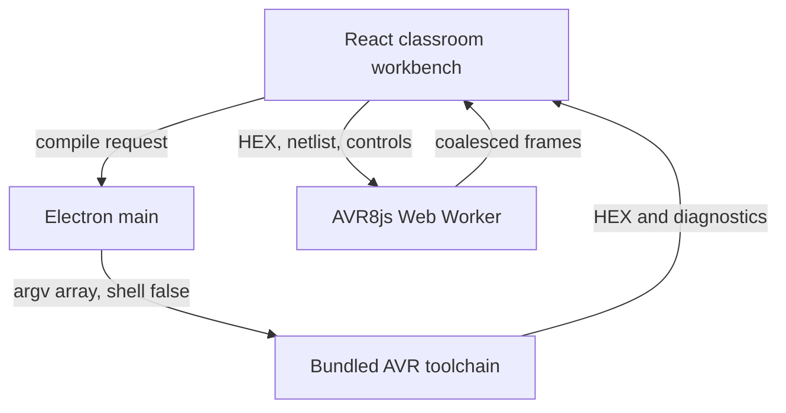

# UI Canvas and Cross-Platform Packaging Specification

**Project:** Offline Arduino Simulator  
**Stack:** Electron + Vite + React + TypeScript + Monaco + AVR8js + bundled AVR-GNU toolchain  
**Initial board:** Arduino Uno R3 / ATmega328P / 16 MHz  
**Status:** final implementation specification  
**Companion documents:** `OFFLINE_ARDUINO_SIMULATOR_SETUP_SPEC.md`, `FRONTEND_AND_SIMULATOR_WORKER_SPEC.md`  
**Operating rule:** after the installer or portable package reaches a computer, compilation, simulation, examples, help, saving, and reopening must work with all network interfaces unavailable.

---

## 1. Purpose and fixed decisions

This document completes the product-facing architecture. It specifies:

1. the resizable three-pane classroom workbench;
2. the offline starter library and its circuit auto-population contract;
3. the student-friendly compiler-diagnostic parser and Monaco integration;
4. the exact Electron Builder release configuration;
5. native toolchain resource mapping and runtime resolution;
6. a safe offline installation-help screen for unsigned classroom builds.

The following decisions are mandatory:

- The renderer owns editor, circuit-authoring, layout, selection, and presentation state.
- Electron main owns filesystem access, temporary build workspaces, native process execution, and raw compiler output.
- The simulation Web Worker owns mutable AVR8js, peripheral, netlist-runtime, component-protocol, and simulated-time state.
- The renderer receives validated Intel HEX content and structured diagnostics. It never receives native executable paths or temporary paths.
- Monaco, examples, Arduino core, supported libraries, help, fonts, icons, and every native compiler dependency are local packaged resources.
- The circuit canvas uses programmatic native SVG. No remote images, CDNs, telemetry, advertisements, or paid assets are permitted.
- Windows releases include an NSIS installer and a no-install portable executable.
- The macOS release is one Universal DMG. It carries separate Intel and Apple Silicon AVR toolchains and selects the correct one at runtime.
- Linux x64 is distributed as an AppImage.
- `extraResources` places native payloads outside `app.asar`; they are resolved only in Electron main through `process.resourcesPath`.
- Unsigned-build guidance permits a single, explicit OS exception only after provenance and hash checks. It must never disable SmartScreen, Gatekeeper, antivirus, or school policy globally.



---

# Module A — Desktop UI Layout and React Components

## 2. Window and workbench geometry

### 2.1 Supported dimensions

| Item | Requirement |
| --- | --- |
| Recommended design size | 1440 × 900 logical pixels |
| Supported minimum | 1024 × 720 logical pixels |
| Default editor/canvas split | 46% / 54% |
| Editor minimum width | 400 px |
| Canvas minimum width | 460 px |
| Bottom panel default height | 240 px |
| Bottom panel range | 160–40% of workbench height |
| Command bar | 48 px |
| Status bar | 24 px |
| Pointer splitter hit area | at least 12 px |
| Visible splitter | 4–6 px |

The default workbench is a two-column top region plus a full-width bottom region:

```text
Command bar
┌───────────────────────┬────────────────────────────────┐
│ Monaco Code Editor    │ Interactive Circuit Canvas     │
│ source tabs           │ component tray / SVG workspace│
│ markers + highlights  │ inspector / wiring feedback   │
├───────────────────────┴────────────────────────────────┤
│ Serial Monitor | Problems | Circuit & Runtime          │
└────────────────────────────────────────────────────────┘
Status bar
```

Use CSS Grid so resizing one pane does not cause expensive absolute-position recalculation in the other panes.

```css
.workbench {
  --editor-width: 46%;
  --bottom-height: 240px;
  display: grid;
  grid-template-columns:
    minmax(400px, var(--editor-width))
    6px
    minmax(460px, 1fr);
  grid-template-rows:
    minmax(320px, 1fr)
    6px
    minmax(160px, var(--bottom-height));
  height: calc(100vh - 72px);
  min-width: 1024px;
  min-height: 648px;
  overflow: hidden;
}

.editorPane { grid-column: 1; grid-row: 1; min-width: 0; min-height: 0; }
.columnSplitter { grid-column: 2; grid-row: 1; }
.canvasPane { grid-column: 3; grid-row: 1; min-width: 0; min-height: 0; }
.rowSplitter { grid-column: 1 / 4; grid-row: 2; }
.bottomPane { grid-column: 1 / 4; grid-row: 3; min-width: 0; min-height: 0; }
```

At 1024–1099 px, provide an optional **Editor / Circuit** focus switch. Do not remove the bottom diagnostics pane. The application is a desktop product; widths below 1024 px are outside the supported workbench contract.

### 2.2 Splitter behavior

Each splitter is a semantic separator:

```tsx
<div
  role="separator"
  aria-label="Resize code editor and circuit canvas"
  aria-orientation="vertical"
  aria-valuemin={400}
  aria-valuemax={availableWidth - 460}
  aria-valuenow={editorPixels}
  tabIndex={0}
  onKeyDown={handleSplitterKeys}
/>
```

Rules:

- Dragging updates a CSS custom property through `requestAnimationFrame`; it does not write to React state for every pointer event.
- Commit the final size to preferences on pointer-up.
- Arrow keys move 8 px; Shift+Arrow moves 32 px; Home and End move to supported limits.
- Double-click restores the default split.
- Persist layout under a versioned local preference key, not inside the student project.
- Monaco receives `editor.layout()` only after a throttled resize notification.
- The SVG viewport changes its view box without rerendering every component.
- When a compile error occurs, select **Problems** and expand the bottom pane to at least 220 px. Never hide the editor.

## 3. React component tree

```text
<AppShell>
├─ <TitleBarActions />
├─ <CommandBar>
│  ├─ <ProjectCommands />
│  ├─ <CompileCommands />
│  ├─ <SimulationCommands />
│  └─ <BoardAndPerformanceControls />
├─ <Workbench>
│  ├─ <EditorPane>
│  │  ├─ <SourceTabs />
│  │  ├─ <MonacoSketchEditor />
│  │  └─ <EditorStatus />
│  ├─ <PaneSplitter orientation="vertical" />
│  ├─ <CircuitPane>
│  │  ├─ <CircuitToolbar />
│  │  ├─ <ComponentTray />
│  │  ├─ <CircuitCanvas />
│  │  └─ <PropertiesInspector />
│  ├─ <PaneSplitter orientation="horizontal" />
│  └─ <BottomPane>
│     ├─ <BottomTabs />
│     ├─ <VirtualSerialMonitor />
│     ├─ <ProblemsView />
│     └─ <CircuitRuntimeDiagnostics />
├─ <StatusBar />
├─ <ExamplesLibraryDialog />
├─ <OfflineInstallGuideDialog />
└─ <ConfirmDialogHost />
```

Lazy-load `ExamplesLibraryDialog` and `OfflineInstallGuideDialog`. Do not lazy-load the main workbench from a network URL; every JavaScript chunk is local and included in the package.

## 4. State ownership and communication

Use Zustand or an equivalent small typed store. Do not put Monaco, Worker, Electron, DOM, or AVR8js instances in the store.

```ts
interface RootState {
  project: ProjectSlice;
  compiler: CompilerSlice;
  circuit: CircuitAuthoringSlice;
  simulation: SimulationMirrorSlice;
  serial: SerialSlice;
  examples: ExamplesSlice;
  layout: LayoutSlice;
  preferences: PreferencesSlice;
}
```

### 4.1 State boundaries

| Owner | Authoritative state |
| --- | --- |
| Monaco model | text for every open source file |
| Project slice | debounced serializable source snapshots, project metadata |
| Circuit slice | components, terminals, logical wires, explicit junctions |
| Compiler slice | request, source revision, phase, diagnostics, last valid HEX |
| Worker | AVR CPU, ports, timers, ADC, UART, LCD/servo runtime, simulated time |
| Simulation mirror | immutable display deltas from latest valid worker frame |
| Serial slice | bounded decoded records and input preferences |
| Layout slice | pane sizes, selected bottom tab, tray/inspector visibility |

### 4.2 Revision safety

Every compile request contains `requestId` and `sourceRevision`. A result is current only when both match the active request and current Monaco revision.

Every worker message contains `sessionId` and protocol version. Drop messages from an old or disposed worker. Apply a worker frame in one store transaction.

`Run` behavior:

1. Snapshot Monaco models.
2. If source is stale, compile that exact revision.
3. If compilation succeeds and the revision remains current, validate circuit topology.
4. Dispose the previous worker.
5. Create a new worker and send the validated netlist and HEX.
6. Start only after the worker returns `READY`.

Topology is locked while running. Pushbuttons, potentiometers, serial input, pause, step, speed, and reset remain interactive.

## 5. Monaco Code Editor pane

Required behavior:

- Bundle Monaco and its language workers through Vite. No CDN or remote font is allowed.
- Stable model URI: `offline-arduino://project/<projectId>/<relativePath>`.
- Default file is `Sketch.ino`; local `.h`, `.c`, and `.cpp` files are supported inside the project.
- Default font is a bundled/system monospace stack at 14 px with 1.5 line height.
- Minimap is off by default for low-spec hardware.
- Keep line numbers, bracket matching, search, replace, folding, and basic local Arduino snippets.
- Cap an individual source file at 1 MiB before IPC.
- Remap generated preprocessor locations to original `.ino` locations.
- Apply Monaco markers only if `sourceRevision` still matches.
- Clicking a Problem focuses the file, line, and column and reveals the token.
- Use error glyphs plus underline/squiggle; do not communicate severity using color alone.
- Preserve sanitized raw compiler text under a collapsed **Technical details** disclosure.

## 6. Interactive Circuit Canvas pane

The detailed solver and component runtime live in `FRONTEND_AND_SIMULATOR_WORKER_SPEC.md`. This module defines the authoring UI.

### 6.1 SVG scene layers

```text
<svg>
├─ gridLayer
├─ guideLayer
├─ wireVisibleLayer
├─ junctionLayer
├─ componentLayer
├─ labelLayer
├─ selectionLayer
└─ interactionLayer
```

- Visible wires use 2–3 px strokes.
- Transparent hit paths are at least 12 px wide.
- Terminals have at least a 20 × 20 px interaction area.
- Store components and user waypoints, not generated SVG path strings.
- Crossing wires do not connect unless an explicit junction is present.
- Wire color is a convention and warning source, never the connectivity algorithm.
- Red is VCC, black is GND, and yellow/blue/green/orange/purple are signals.
- Pan/zoom uses one viewport transform. Do not rewrite every component coordinate.
- During simulation, update only affected display attributes such as LED opacity, LCD text, servo horn rotation, and pin badges.

### 6.2 Authoring interactions

| Action | Behavior |
| --- | --- |
| Add component | choose tray item, click canvas, create one undoable command |
| Move | snap to 8 px grid unless Alt is held |
| Wire | start at terminal, preview orthogonal route, finish at terminal/junction |
| Select | click; Shift-click adds; drag rectangle selects components only |
| Rotate | 90° increments; terminal coordinates update deterministically |
| Delete | remove selected item and dependent wire endpoints after confirmation if destructive |
| Undo/redo | authoring commands only; never simulation frames or serial records |
| Inspect | edit safe bounded properties such as resistance and label |

The canvas provides immediate validation for reverse LEDs, LED without current limiting, rail shorts, conflicting output drivers, floating input pins, unsupported LCD mode, and missing servo power/ground.

## 7. Bottom Serial/Diagnostics pane

Tabs:

1. **Serial Monitor** — UTF-8/hex output, bounded input, line ending selection.
2. **Problems** — compiler, circuit, runtime, and installation findings.
3. **Circuit & Runtime** — cycles, simulated milliseconds, effective speed, worker drift, recent pin/component deltas.

Limits:

- Flush serial bytes from worker to React at most once every 16 ms or at 1024 bytes.
- Retain at most 10,000 records or 1 MiB decoded text, whichever occurs first.
- Show how many older records were discarded.
- Virtualize long lists.
- Pause visual autoscroll when the user scrolls upward; keep collecting within limits.
- Never block the simulation worker on terminal rendering.

## 8. Classroom UX rules

- Use plain language first and technical detail second.
- Every irreversible overwrite or reset requires a clear confirmation.
- Save recovery snapshots locally; never require an account.
- Use consistent verbs: **Verify**, **Run**, **Pause**, **Step**, **Reset**, **Stop**.
- Show **OFFLINE READY** in the status bar only after packaged resource self-check succeeds.
- Do not show connectivity errors when there is no network; offline is the normal operating state.
- Respect system light/dark preference, but use a high-contrast classroom theme by default.
- Minimum body text is 14 px; minimum target size is 36 × 36 px, preferably 40 × 40 px.
- Provide keyboard access to all commands, splitters, tabs, canvas components, terminals, and help.
- Respect reduced-motion settings. LED and servo state may update, but decorative transitions are removed.
- Low-spec mode defaults to 30 FPS and disables canvas shadows, animated wire flow, Monaco minimap, and nonessential transitions.

---

# Module B — Offline Classroom Starter Library

## 9. Resource layout

Starter content is immutable packaged content:

```text
resources/examples/
├─ index.json
├─ schemas/
│  ├─ example.schema.json
│  └─ circuit.schema.json
├─ blink/
│  ├─ example.json
│  ├─ Sketch.ino
│  └─ circuit.json
├─ pushbutton/
├─ potentiometer/
├─ lcd-hello-world/
└─ servo-sweep/
```

Opening an example always creates an editable copy in the user's chosen project location or local application data directory. The bundled original is never modified.

## 10. Example manifest contract

```ts
interface OfflineExampleManifest {
  schemaVersion: 1;
  id: string;
  title: string;
  summary: string;
  difficulty: 'beginner' | 'intermediate';
  estimatedMinutes: number;
  board: 'uno';
  concepts: string[];
  learningObjectives: string[];
  source: 'Sketch.ino';
  circuit: 'circuit.json';
  requiredLibraries: string[];
  expectedBehavior: string;
  wiringChecklist: string[];
  predictPrompt: string;
  observePrompt: string;
  tryNext: string[];
  supportedSince: string;
}
```

`index.json` contains only summarized records for fast card rendering. The application validates a full manifest and circuit before opening the copy.

## 11. Starter library UI

`ExamplesLibraryDialog` contains:

- local search by title/concept;
- filters for difficulty and component;
- five programmatic SVG thumbnail cards;
- learning time, concepts, and expected behavior;
- **Preview Wiring** and **Open a Copy** actions;
- an instruction drawer with Objectives, Wiring Checklist, Predict, Observe, and Try Next;
- a visible statement: **Works completely offline**.

No lesson depends on videos, external documentation, links, remote fonts, or analytics.

When **Open a Copy** is chosen:

1. Validate manifest and paths.
2. Generate a new project ID.
3. Copy source and circuit into a writable project object.
4. Resolve circuit component definitions from the bundled registry.
5. Fit the SVG viewport to all components.
6. Open `Sketch.ino` in Monaco.
7. Show the instruction drawer.
8. Do not compile or run until the student chooses Verify or Run.

## 12. Required examples and exact circuit intent

### 12.1 Blink

**Purpose:** `pinMode`, `digitalWrite`, and `delay`.  
**Circuit:** Uno with the built-in D13/`LED_BUILTIN` indicator highlighted; no external wiring is required.  
**Expected:** built-in LED alternates every 500 ms.

```cpp
void setup() {
  pinMode(LED_BUILTIN, OUTPUT);
}

void loop() {
  digitalWrite(LED_BUILTIN, HIGH);
  delay(500);
  digitalWrite(LED_BUILTIN, LOW);
  delay(500);
}
```

The canvas auto-populates one Uno component and a callout that the D13 LED is already on the board.

### 12.2 Pushbutton

**Purpose:** active-low input and the Uno internal pull-up.  
**Circuit:** pushbutton terminal A to D2; terminal B to GND; built-in D13 LED.  
**Expected:** pressing the virtual button lights the built-in LED.

```cpp
const byte BUTTON_PIN = 2;

void setup() {
  pinMode(BUTTON_PIN, INPUT_PULLUP);
  pinMode(LED_BUILTIN, OUTPUT);
}

void loop() {
  const bool pressed = digitalRead(BUTTON_PIN) == LOW;
  digitalWrite(LED_BUILTIN, pressed ? HIGH : LOW);
}
```

The starter diagram must not add an external pull-down because that would contradict `INPUT_PULLUP` and confuse the lesson.

### 12.3 Potentiometer

**Purpose:** voltage divider and `analogRead`.  
**Circuit:** 10 kΩ pot outer pins to 5V and GND; wiper to A0.  
**Expected:** Serial Monitor prints a value approximately from 0 to 1023.

```cpp
void setup() {
  Serial.begin(9600);
}

void loop() {
  Serial.println(analogRead(A0));
  delay(100);
}
```

The inspector initializes the wiper to 50%. Moving it sends a bounded control event to the worker; it never writes the ADC register from React.

### 12.4 LCD 16×2 — Hello World

**Purpose:** HD44780 four-bit data transfer and `LiquidCrystal`.  
**Circuit:** `RS→D12`, `E→D11`, `D4→D5`, `D5→D4`, `D6→D3`, `D7→D2`, `VSS/RW/K→GND`, `VDD/A→5V`, `VO` to a fixed classroom contrast model or supported contrast control.  
**Expected:** first row shows `Offline Arduino`; second row shows `Ready!`.

```cpp
#include <LiquidCrystal.h>

LiquidCrystal lcd(12, 11, 5, 4, 3, 2);

void setup() {
  lcd.begin(16, 2);
  lcd.print("Offline Arduino");
  lcd.setCursor(0, 1);
  lcd.print("Ready!");
}

void loop() {}
```

The exact bundled `LiquidCrystal` version is pinned and compiled in release tests. The runtime supports the HD44780 four-bit protocol only; eight-bit mode produces an explicit unsupported-configuration diagnostic.

### 12.5 Servo Sweep

**Purpose:** servo pulse timing and angle control.  
**Circuit:** servo signal to D9, VCC to 5V, ground to GND.  
**Expected:** horn sweeps 0°→180°→0°.

```cpp
#include <Servo.h>

Servo classroomServo;

void setup() {
  classroomServo.attach(9);
}

void loop() {
  for (int angle = 0; angle <= 180; angle++) {
    classroomServo.write(angle);
    delay(15);
  }
  for (int angle = 180; angle >= 0; angle--) {
    classroomServo.write(angle);
    delay(15);
  }
}
```

The simulation measures the emitted pulse width and derives the display angle. The canvas does not infer the angle from the source code.

## 13. Starter validation gates

Release CI must:

1. validate every example and circuit against JSON Schema;
2. reject duplicate IDs, missing paths, path traversal, unknown libraries, and unsupported components;
3. compile each sketch using only the packaged core, library, and toolchain resources;
4. validate the generated Intel HEX;
5. load it into the worker;
6. run a deterministic behavioral assertion;
7. verify the circuit contains no error-level diagnostic;
8. open every example while outbound network access is blocked;
9. confirm **Open a Copy** never mutates packaged content.

---

# Module C — Student-Friendly Error Parser

## 14. Security and ownership

Raw `avr-gcc`/`avr-g++` output is parsed and sanitized in Electron main. The renderer receives only structured diagnostics with stable project URIs. Absolute temporary directories, user names, installation paths, executable paths, environment values, and raw child-process objects never cross IPC.

```ts
interface CompilerDiagnostic {
  id: string;
  phase: 'preprocess' | 'compile' | 'archive' | 'link' | 'objcopy' | 'size' | 'system';
  severity: 'info' | 'warning' | 'error' | 'fatal';
  code: string;
  fileUri?: string;
  line?: number;
  column?: number;
  endColumn?: number;
  title: string;
  explanation: string;
  suggestedActions: string[];
  related?: Array<{ fileUri?: string; line?: number; message: string }>;
  technicalDetail?: string;
  sourceRevision: number;
}
```

## 15. Parsing pipeline

1. Capture stdout and stderr independently in bounded byte buffers.
2. Stop the compiler if configured output limits are exceeded.
3. Decode UTF-8 using replacement for malformed input.
4. Normalize line endings.
5. Parse primary GCC messages, continuation lines, notes, caret ranges, linker messages, and system failures.
6. Replace every private build path with a stable project URI.
7. Use the preprocessor line map/`#line` directives to remap generated C++ locations to the original `.ino` file.
8. Match the pinned compiler's diagnostic code when available.
9. Otherwise apply a conservative, versioned message rule.
10. Add plain-language title, explanation, and one to three actions.
11. Preserve only sanitized raw text in **Technical details**.
12. If no rule matches, use a neutral fallback; never invent the likely fix.

Recommended internal types:

```ts
interface RawDiagnosticRecord {
  tool: 'avr-gcc' | 'avr-g++' | 'avr-ar' | 'avr-objcopy' | 'avr-size' | 'linker' | 'system';
  phase: CompilerDiagnostic['phase'];
  severity: CompilerDiagnostic['severity'];
  compilerCode?: string;
  rawFile?: string;
  rawLine?: number;
  rawColumn?: number;
  message: string;
  notes: string[];
  caret?: { start: number; end: number };
}

interface DiagnosticRule {
  id: string;
  compilerCodes?: string[];
  pattern?: RegExp;
  applies(record: RawDiagnosticRecord): boolean;
  translate(record: RawDiagnosticRecord): Pick<
    CompilerDiagnostic,
    'code' | 'title' | 'explanation' | 'suggestedActions'
  >;
}
```

Rule evaluation is ordered from most specific to least specific. It must not parse paths using one platform-only regular expression. Normalize Windows drive paths, POSIX paths, and the stable virtual sketch URI.

## 16. Minimum translation catalog

| Raw category/pattern | Student title | Explanation/action intent |
| --- | --- | --- |
| `expected ';' before ...` | A semicolon may be missing | Check the highlighted line and the line immediately above it |
| `was not declared in this scope` | This name has not been defined here | Check spelling, capitalization, and whether it was declared before use |
| include `No such file or directory` | This header or library is unavailable | Correct the include name or use a supported bundled library; never instruct an internet install |
| duplicate `setup` or `loop` | This sketch defines the function twice | Keep exactly one `setup()` and one `loop()` |
| `expected '}' at end of input` | A closing brace is missing | Match every opening `{` with a closing `}` |
| `expected ')'` | A closing parenthesis may be missing | Check the highlighted call/condition and the previous line |
| `invalid conversion` | This value has the wrong type | Compare the value with the function parameter or variable type |
| `too few arguments` | This function needs more information | Review the function hint and add the required argument |
| `too many arguments` | This function received too many values | Review the function hint and remove the extra argument |
| `undefined reference to ...` | Code was declared but could not be linked | Check spelling and make sure the function has an implementation |
| flash region overflow | The sketch is too large for Uno program memory | Remove unused code/data or reduce bundled-library use |
| SRAM/data overflow | Global data is too large for Uno memory | Reduce global arrays/strings and store fixed text in flash when taught |
| process timeout | Compilation took too long and was stopped | Retry once; repeated failure is an installation/project issue |
| tool missing/hash mismatch | Offline compiler files are damaged or incomplete | Use the verified classroom package; do not download from inside the app |

Example translation:

```text
Raw technical message:
Sketch.ino:8:3: error: expected ';' before '}' token

Student view:
A semicolon may be missing
The compiler reached the closing brace before the previous statement was complete.

Try this:
1. Check line 8.
2. Check the statement immediately above the highlighted brace.
3. Add a semicolon only if that statement requires one.
```

Do not promise that adding a semicolon will fix the sketch. GCC often reports a cascade location rather than the true source line.

## 17. Monaco marker mapping

```ts
function toMonacoMarker(d: CompilerDiagnostic): monaco.editor.IMarkerData {
  const line = Math.max(1, d.line ?? 1);
  const column = Math.max(1, d.column ?? 1);
  return {
    severity:
      d.severity === 'warning'
        ? monaco.MarkerSeverity.Warning
        : d.severity === 'info'
          ? monaco.MarkerSeverity.Info
          : monaco.MarkerSeverity.Error,
    code: d.code,
    message: `${d.title}\n${d.explanation}`,
    startLineNumber: line,
    startColumn: column,
    endLineNumber: line,
    endColumn: Math.max(column + 1, d.endColumn ?? column + 1),
    source: 'Offline Arduino Simulator',
  };
}
```

Apply markers only to the exact source revision that produced them. Clear compile markers when a newer compile begins, but retain a visible compiling state. Circuit/runtime markers use a different Monaco owner key so one subsystem cannot delete another subsystem's findings.

## 18. Error parser quality rules

- Preserve compiler severity.
- Keep the first explanation to two short sentences.
- Never say “just” or blame the student.
- Never recommend downloading a library or toolchain.
- Use locally supported alternatives when one exists.
- If the likely cause is earlier, explicitly say so.
- Group duplicate cascades but retain a count and technical expansion.
- Show the first likely root issue before downstream linker/cascade messages.
- Snapshot-test all catalog rules against the pinned AVR-GNU version.
- Include Windows and POSIX path fixtures.
- Fuzz the parser with malformed and very long lines.
- Enforce output, count, field-length, and nested-note limits before IPC.

---

# Module D — Cross-Platform Packaging

## 19. Release matrix

| Host target | Architecture | Artifact | Admin needed | Toolchain payload |
| --- | --- | --- | --- | --- |
| Windows 10/11 | x64 | NSIS `.exe` | no for per-user configuration | `win32-x64` |
| Windows 10/11 | x64 | Portable standalone `.exe` | no | `win32-x64` |
| macOS | Universal x64 + arm64 | Universal `.dmg` | normally no when installed to a user-writable Applications folder | `darwin-x64` + `darwin-arm64` |
| Linux | x64 | `.AppImage` | no | `linux-x64` |

The portable Windows artifact is the safest no-admin fallback for classroom and personal laptops. It still writes projects/preferences to the user's writable data directories unless a deliberate portable-data mode is separately implemented.

## 20. Required vendor layout

```text
vendor/
├─ toolchains/
│  ├─ win32-x64/
│  │  ├─ bin/avr-gcc.exe
│  │  ├─ bin/avr-g++.exe
│  │  ├─ bin/avr-ar.exe
│  │  ├─ bin/avr-objcopy.exe
│  │  ├─ bin/avr-size.exe
│  │  ├─ avr/
│  │  ├─ lib/
│  │  ├─ libexec/
│  │  └─ manifest.json
│  ├─ darwin-x64/
│  ├─ darwin-arm64/
│  └─ linux-x64/
├─ arduino-avr/
│  ├─ cores/arduino/
│  ├─ variants/standard/
│  └─ libraries/
└─ licenses/

resources/
├─ examples/
├─ help/
│  ├─ installation-guide.json
│  └─ installation-guide.html
├─ schemas/
└─ app-assets/
```

Preserve the complete audited toolchain layout. GCC discovers internal executables, specs, headers, startup objects, libraries, and DLLs relative to its prefix. Copying only `avr-gcc` is invalid.

## 21. Exact `electron-builder.yml`

The configuration below assumes an exact pinned Electron Builder version. Run its configuration/schema validation in CI whenever the dependency changes.

```yaml
appId: com.client.offlinearduinosimulator
productName: Offline Arduino Simulator
executableName: offline-arduino-simulator
copyright: Copyright © 2026

asar: true

directories:
  output: release
  buildResources: build

files:
  - dist/main/**/*
  - dist/preload/**/*
  - dist/renderer/**/*
  - package.json

# Shared, architecture-independent offline resources. extraResources are copied
# outside app.asar into process.resourcesPath.
extraResources:
  - from: vendor/arduino-avr
    to: runtime/arduino-avr
    filter:
      - "**/*"
  - from: vendor/licenses
    to: runtime/licenses
    filter:
      - "**/*"
  - from: resources/examples
    to: runtime/examples
    filter:
      - "**/*"
  - from: resources/help
    to: runtime/help
    filter:
      - "**/*"
  - from: resources/schemas
    to: runtime/schemas
    filter:
      - "**/*"

afterPack: scripts/verify-packaged-resources.cjs

win:
  icon: build/icon.ico
  requestedExecutionLevel: asInvoker
  target:
    - target: nsis
      arch:
        - x64
    - target: portable
      arch:
        - x64
  extraResources:
    - from: vendor/toolchains/${env.TOOLCHAIN_ID}
      to: runtime/toolchains/${env.TOOLCHAIN_ID}
      filter:
        - "**/*"

nsis:
  artifactName: ${productName}-${version}-Windows-x64-Setup.${ext}
  oneClick: true
  perMachine: false
  createDesktopShortcut: true
  createStartMenuShortcut: true
  shortcutName: Offline Arduino Simulator
  runAfterFinish: true
  deleteAppDataOnUninstall: false

portable:
  artifactName: ${productName}-${version}-Windows-x64-Portable.${ext}

mac:
  icon: build/icon.icns
  category: public.app-category.developer-tools
  minimumSystemVersion: "11.0"
  identity: null
  hardenedRuntime: false
  mergeASARs: true
  target:
    - target: dmg
      arch:
        - universal
  artifactName: ${productName}-${version}-macOS-Universal.${ext}
  extraResources:
    - from: vendor/toolchains/darwin-x64
      to: runtime/toolchains/darwin-x64
      filter:
        - "**/*"
    - from: vendor/toolchains/darwin-arm64
      to: runtime/toolchains/darwin-arm64
      filter:
        - "**/*"

dmg:
  sign: false
  title: ${productName} ${version}
  contents:
    - x: 130
      y: 220
    - x: 410
      y: 220
      type: link
      path: /Applications

linux:
  icon: build/icons
  category: Development
  synopsis: Offline Arduino Uno classroom simulator
  description: Compile and simulate supported Arduino Uno classroom projects without internet access.
  target:
    - target: AppImage
      arch:
        - x64
  artifactName: ${productName}-${version}-Linux-${arch}.${ext}
  extraResources:
    - from: vendor/toolchains/${env.TOOLCHAIN_ID}
      to: runtime/toolchains/${env.TOOLCHAIN_ID}
      filter:
        - "**/*"

appImage:
  artifactName: ${productName}-${version}-Linux-${arch}.${ext}

publish: null
```

### 21.1 Configuration notes

- `TOOLCHAIN_ID` must equal `win32-x64` for Windows and `linux-x64` for Linux. A prebuild validation script must reject an absent or different value.
- macOS intentionally carries both Darwin toolchains because the final application is Universal. Runtime selects the native toolchain by `process.arch`.
- Native toolchains are not placed in `files` and are not added to `asarUnpack`; `extraResources` already keeps them outside ASAR.
- `requestedExecutionLevel: asInvoker` and `nsis.perMachine: false` avoid an administrator requirement for the per-user Windows build.
- Windows portable and NSIS artifacts use different target-level artifact names to prevent `.exe` collisions.
- `identity: null` and `hardenedRuntime: false` describe the requested zero-cost unsigned macOS release. If paid Developer ID signing is later enabled, remove these two unsigned overrides, enable Hardened Runtime, add the required entitlements, sign every nested Mach-O helper, and notarize the outer app/DMG.
- A Universal Electron app does not make the AVR-GNU tools universal. The two native toolchain folders remain separate and only the matching folder executes.
- Build and smoke-test on the target operating system. Test the Universal DMG on both an Intel Mac and an Apple Silicon Mac.
- `publish: null` prevents updater publishing configuration. Do not include `electron-updater` network behavior in the installed classroom app.
- Adjust `minimumSystemVersion` to the minimum supported by the pinned Electron major. Never claim a macOS version older than Electron supports.

## 22. Dynamic toolchain preflight

```js
// scripts/validate-toolchain-target.cjs
const fs = require('node:fs');
const path = require('node:path');

const platform = process.env.BUILD_PLATFORM;
const id = process.env.TOOLCHAIN_ID;
const expected = {
  win32: 'win32-x64',
  linux: 'linux-x64',
};

if (!(platform in expected)) {
  throw new Error(`BUILD_PLATFORM must be one of: ${Object.keys(expected).join(', ')}`);
}
if (id !== expected[platform]) {
  throw new Error(`TOOLCHAIN_ID must be ${expected[platform]} for ${platform}`);
}

const root = path.resolve('vendor', 'toolchains', id);
const suffix = platform === 'win32' ? '.exe' : '';
for (const name of ['avr-gcc', 'avr-g++', 'avr-ar', 'avr-objcopy', 'avr-size']) {
  const file = path.join(root, 'bin', `${name}${suffix}`);
  if (!fs.existsSync(file)) throw new Error(`Missing toolchain file: ${file}`);
}
if (!fs.existsSync(path.join(root, 'manifest.json'))) {
  throw new Error(`Missing toolchain manifest for ${id}`);
}
```

Suggested scripts use `cross-env` for identical environment syntax:

```json
{
  "scripts": {
    "dist:win": "cross-env BUILD_PLATFORM=win32 TOOLCHAIN_ID=win32-x64 node scripts/validate-toolchain-target.cjs && electron-builder --config electron-builder.yml --win --x64",
    "dist:mac": "node scripts/verify-darwin-toolchains.cjs && electron-builder --config electron-builder.yml --mac --universal",
    "dist:linux": "cross-env BUILD_PLATFORM=linux TOOLCHAIN_ID=linux-x64 node scripts/validate-toolchain-target.cjs && electron-builder --config electron-builder.yml --linux --x64"
  }
}
```

## 23. Runtime resource resolver

Only Electron main imports this module.

```ts
import { app } from 'electron';
import { access, realpath } from 'node:fs/promises';
import { constants } from 'node:fs';
import path from 'node:path';

const SUPPORTED = new Set([
  'win32-x64',
  'darwin-x64',
  'darwin-arm64',
  'linux-x64',
]);

export interface ToolchainLayout {
  id: string;
  root: string;
  arduinoRoot: string;
  gcc: string;
  gpp: string;
  ar: string;
  objcopy: string;
  size: string;
}

function executable(root: string, name: string): string {
  return path.join(root, 'bin', `${name}${process.platform === 'win32' ? '.exe' : ''}`);
}

export async function resolveToolchain(): Promise<ToolchainLayout> {
  const id = `${process.platform}-${process.arch}`;
  if (!SUPPORTED.has(id)) throw new Error(`UNSUPPORTED_HOST:${id}`);

  const resourcesRoot = app.isPackaged
    ? process.resourcesPath
    : path.resolve(app.getAppPath());

  const root = app.isPackaged
    ? path.join(resourcesRoot, 'runtime', 'toolchains', id)
    : path.join(resourcesRoot, 'vendor', 'toolchains', id);

  const arduinoRoot = app.isPackaged
    ? path.join(resourcesRoot, 'runtime', 'arduino-avr')
    : path.join(resourcesRoot, 'vendor', 'arduino-avr');

  const canonicalRoot = await realpath(root);
  const layout: ToolchainLayout = {
    id,
    root: canonicalRoot,
    arduinoRoot: await realpath(arduinoRoot),
    gcc: executable(canonicalRoot, 'avr-gcc'),
    gpp: executable(canonicalRoot, 'avr-g++'),
    ar: executable(canonicalRoot, 'avr-ar'),
    objcopy: executable(canonicalRoot, 'avr-objcopy'),
    size: executable(canonicalRoot, 'avr-size'),
  };

  for (const candidate of [layout.gcc, layout.gpp, layout.ar, layout.objcopy, layout.size]) {
    const canonical = await realpath(candidate);
    const relative = path.relative(canonicalRoot, canonical);
    if (relative.startsWith('..') || path.isAbsolute(relative)) {
      throw new Error('TOOLCHAIN_PATH_ESCAPE');
    }
    await access(
      canonical,
      process.platform === 'win32' ? constants.F_OK : constants.X_OK,
    );
  }

  return layout;
}
```

The compiler service invokes the resolved absolute executable with an argument array, `shell: false`, a private temporary `cwd`, bounded output, timeout/cancellation, and a minimal environment whose `PATH` starts with the bundled `bin` directory. It never falls back to a system compiler.

## 24. Packaged-resource verification

The `afterPack` hook must:

- locate the platform resources directory;
- verify Arduino core, Uno variant, examples, help, schemas, licenses, and toolchain manifests;
- verify required compiler executables and internal manifest paths;
- set executable bits on Unix before signing/distribution;
- reject absolute or parent-traversal manifest paths;
- fail packaging if the wrong target toolchain exists or the required one is absent;
- for Universal macOS, require both Darwin folders;
- never modify nested executables after signing.

Hash verification is separate and mandatory both before packaging and at first compiler use. Presence checking does not replace SHA-256 checking.

## 25. Release gates

A release is blocked unless:

- dependency lockfile and exact Electron/Electron Builder versions are pinned;
- installation and runtime complete with outbound traffic blocked;
- no renderer bundle contains required `http://`, `https://`, CDN, remote font, analytics, updater, or remote Monaco worker reference;
- vendor archive and unpacked file hashes match lock manifests;
- required licenses and source-distribution obligations are fulfilled;
- Blink compiles on a clean machine with no Arduino IDE and no system AVR compiler;
- the generated HEX loads into AVR8js and toggles D13 at the expected simulated cadence;
- all five examples pass deterministic compile/simulation assertions;
- NSIS installs for the current Windows user without administrator credentials;
- the portable executable launches from a normal writable folder and a teacher-provided read-only medium workflow is documented;
- Universal DMG compiles Blink on both Intel and Apple Silicon Macs using the matching nested toolchain;
- AppImage compiles Blink on the oldest supported Linux distribution image;
- filenames containing spaces and non-ASCII characters pass save/open/compile tests;
- SmartScreen/Gatekeeper help text matches the release artifact name and verified hash manifest;
- clean uninstall does not delete student project files.

---

# Module E — Offline Installation and OS Security Help

## 26. Delivery model

An embedded help screen cannot explain how to open an app that has not opened yet. Therefore ship the same versioned content in two forms:

1. `resources/help/installation-guide.json` rendered inside **Help → Offline Installation & Security**;
2. a standalone `INSTALLATION_GUIDE.html` placed beside the installer/DMG/AppImage on the classroom USB drive or release folder.

Both copies display the exact application version, artifact filename, publisher status, and SHA-256 value from the release manifest. The teacher verifies the offline media before classroom distribution.

## 27. Safety policy for unsigned builds

The guide must say:

- Continue only when the file came directly from the teacher/client's verified classroom package.
- Match the filename and SHA-256 value to the printed or offline manifest.
- A security warning is expected because the zero-cost build is unsigned/not notarized; it is not proof that the file is safe.
- Stop if the filename/hash does not match, antivirus reports malware, macOS says the app “will damage your computer,” or the OS reports that the app is damaged/tampered with.
- Never turn off SmartScreen, Gatekeeper, antivirus, or school device management.
- Never add broad antivirus exclusions.
- Never use global `spctl` or recursive quarantine-removal commands.
- If **Run anyway**/**Open Anyway** is unavailable, the device is probably managed. Stop and ask the teacher or IT administrator; do not evade policy.

## 28. Windows 10/11 student instructions

### NSIS installer

1. Confirm the filename ends with `Windows-x64-Setup.exe` and came from the teacher's verified folder/USB.
2. Compare the displayed SHA-256 with the offline release manifest or ask the teacher to confirm it.
3. Double-click the installer.
4. If **Windows protected your PC** appears, read the application name and publisher status.
5. If they match the teacher's guide, choose **More info**, then **Run anyway**.
6. Complete the per-user installation. This build should not request an administrator password.
7. Launch the app and wait for **OFFLINE READY**.

### Portable executable

1. Copy the portable `.exe` from the classroom media to a normal user-writable folder such as Documents.
2. Verify its filename/hash as above.
3. Double-click it.
4. If SmartScreen warns and the details match the teacher's guide, choose **More info → Run anyway**.
5. Do not run it as administrator.

If Windows does not offer **Run anyway**, stop. School policy may prevent overrides. Do not turn SmartScreen off.

## 29. macOS student instructions

1. Confirm the DMG filename ends with `macOS-Universal.dmg` and came from the verified teacher package.
2. Confirm the teacher/release manifest hash.
3. Open the DMG and drag the app to Applications. If the system Applications folder requires an administrator, use a teacher-approved user Applications folder or ask IT.
4. Try to open the application once.
5. If macOS says the developer cannot be verified or Apple cannot check the app, choose **Done** or close the alert.
6. Open **System Settings → Privacy & Security**.
7. In the Security section, choose **Open Anyway** for Offline Arduino Simulator.
8. Read the confirmation and choose **Open** only if the name/source still match.
9. Return to the app and wait for **OFFLINE READY**.

Apple notes that **Open Anyway** is available only for a limited period after the failed launch. If macOS says the app **will damage your computer** or the app **is damaged**, stop and contact the teacher. Do not use Terminal commands to disable Gatekeeper or remove quarantine recursively.

## 30. Linux AppImage instructions

1. Copy the AppImage to a user-writable folder.
2. Verify the SHA-256 from the offline manifest.
3. Mark it executable through the file manager's permissions UI or run `chmod +x <verified-file-name>.AppImage`.
4. Launch it without `sudo`.
5. If the supported distribution lacks required AppImage/FUSE capability, stop and use the teacher-provided documented fallback. Do not download packages during class.

The release matrix must test the exact Linux distributions used by the school. “AppImage” alone is not proof of universal Linux compatibility.

## 31. Embedded React help template

```tsx
type HelpPlatform = 'windows' | 'macos' | 'linux';

interface VerifiedArtifact {
  platform: HelpPlatform;
  fileName: string;
  sha256: string;
  signed: boolean;
}

interface OfflineInstallGuideProps {
  version: string;
  artifacts: VerifiedArtifact[];
  initialPlatform: HelpPlatform;
  onClose(): void;
}

export function OfflineInstallGuide({
  version,
  artifacts,
  initialPlatform,
  onClose,
}: OfflineInstallGuideProps) {
  const [platform, setPlatform] = React.useState(initialPlatform);
  const artifact = artifacts.find((item) => item.platform === platform);

  return (
    <Dialog
      title="Offline Installation & Security"
      aria-describedby="install-guide-summary"
      onClose={onClose}
    >
      <p id="install-guide-summary">
        Use these steps only for the verified classroom copy of version {version}.
        A warning is expected for an unsigned build, but a warning does not prove a file is safe.
      </p>

      <SafetyCallout tone="warning" title="Check before continuing">
        Match the file name and SHA-256 with the teacher's offline release manifest.
        Never disable system security, antivirus, or school policy.
      </SafetyCallout>

      <PlatformTabs value={platform} onChange={setPlatform}>
        <PlatformTab value="windows">Windows 10/11</PlatformTab>
        <PlatformTab value="macos">macOS</PlatformTab>
        <PlatformTab value="linux">Linux</PlatformTab>
      </PlatformTabs>

      {artifact && (
        <dl className="artifactIdentity">
          <dt>Expected file</dt><dd>{artifact.fileName}</dd>
          <dt>SHA-256</dt><dd><code>{artifact.sha256}</code></dd>
          <dt>Signature</dt><dd>{artifact.signed ? 'Signed' : 'Unsigned classroom build'}</dd>
        </dl>
      )}

      {platform === 'windows' && <WindowsInstallSteps />}
      {platform === 'macos' && <MacInstallSteps />}
      {platform === 'linux' && <LinuxInstallSteps />}

      <SafetyCallout tone="danger" title="Stop and ask the teacher">
        Stop if the hash differs, antivirus reports malware, macOS reports damage,
        or your school prevents the override. Do not work around managed-device policy.
      </SafetyCallout>
    </Dialog>
  );
}
```

Help content comes from a local signed/release manifest generated during packaging. The renderer must not accept arbitrary HTML. Render structured JSON with trusted React components, or sanitize a static standalone HTML copy at build time.

## 32. Help acceptance tests

- Works with every network interface disabled.
- Keyboard and screen-reader navigation passes.
- Exact artifact filenames and hashes match release output.
- Does not advise disabling security or antivirus.
- Distinguishes an unknown-developer warning from a malware/damaged-app warning.
- Handles managed-device refusal by directing the student to teacher/IT.
- Standalone guide is readable before installation.
- Embedded guide is reachable from Welcome and Help menus after launch.
- Screenshots, if later added, are local and versioned; the text remains sufficient if screenshots differ slightly by OS version.

---

# Module F — Definition of Done

## 33. Functional completion checklist

- [ ] Three panes resize by pointer and keyboard and restore safely.
- [ ] Monaco markers open the exact student source location.
- [ ] Circuit canvas is programmatic SVG with accessible terminals and components.
- [ ] Serial rendering remains bounded under continuous output.
- [ ] All five starter examples open as independent editable copies.
- [ ] Every example auto-populates its intended circuit and passes deterministic tests.
- [ ] Raw compiler output is translated, sanitized, and available only as optional technical detail.
- [ ] No temporary or executable paths cross into the renderer.
- [ ] Windows produces separate NSIS and Portable x64 executables.
- [ ] macOS produces one Universal DMG containing both Darwin toolchains.
- [ ] Linux produces one x64 AppImage.
- [ ] Runtime chooses exactly `win32-x64`, `darwin-x64`, `darwin-arm64`, or `linux-x64`.
- [ ] Packaged compiler never falls back to a system installation.
- [ ] All resources work offline on a clean account.
- [ ] Installation/security guidance exists both before and after launch.
- [ ] Security guidance never disables OS protection globally.
- [ ] License, source-offer, and hash manifests ship with the classroom release.

## 34. Implementation order for Claude Code

1. Implement layout shell, splitters, preferences, and accessibility tests.
2. Integrate Monaco models, source revisions, and marker ownership.
3. Implement SVG authoring layers and connect them to the existing netlist compiler contract.
4. Implement bounded bottom-panel tabs and serial virtualization.
5. Add example schemas, five examples, copy-on-open behavior, and CI assertions.
6. Implement raw diagnostic parsing in Electron main, path sanitization, rule catalog, and Monaco mapping.
7. Add the exact Electron Builder configuration and target preflight scripts.
8. Implement packaged-resource verification and runtime resolver.
9. Generate the standalone and embedded installation guides from one structured content source.
10. Run target-native offline smoke tests and release gates before client delivery.

---

## 35. Primary references

- Electron Builder application contents and `extraResources`: https://www.electron.build/docs/configuration/
- Electron Builder Windows targets and portable target: https://www.electron.build/docs/win/
- Electron Builder NSIS options: https://www.electron.build/docs/nsis/
- Electron Builder macOS Universal builds and signing: https://www.electron.build/docs/mac/
- Electron Builder Linux/AppImage targets: https://www.electron.build/docs/linux/
- Apple guidance for safely opening an app from an unidentified developer: https://support.apple.com/en-us/102445
- Microsoft SmartScreen reputation guidance for Windows apps: https://learn.microsoft.com/windows/apps/package-and-deploy/smartscreen-reputation
- Microsoft Defender SmartScreen policy behavior: https://learn.microsoft.com/windows/security/operating-system-security/virus-and-threat-protection/microsoft-defender-smartscreen/available-settings

These external references are for implementers and release maintainers. The installed classroom product must contain sufficient local help and must not require opening any link.
